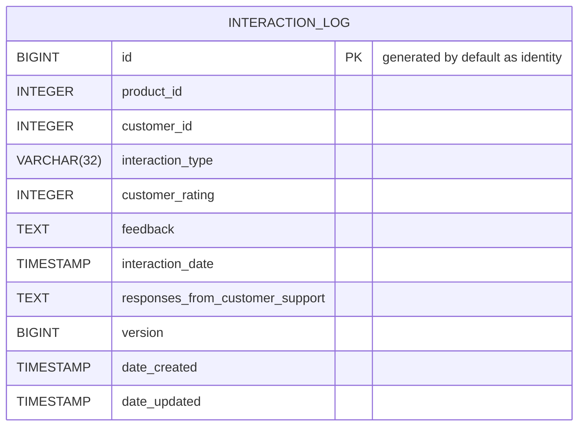
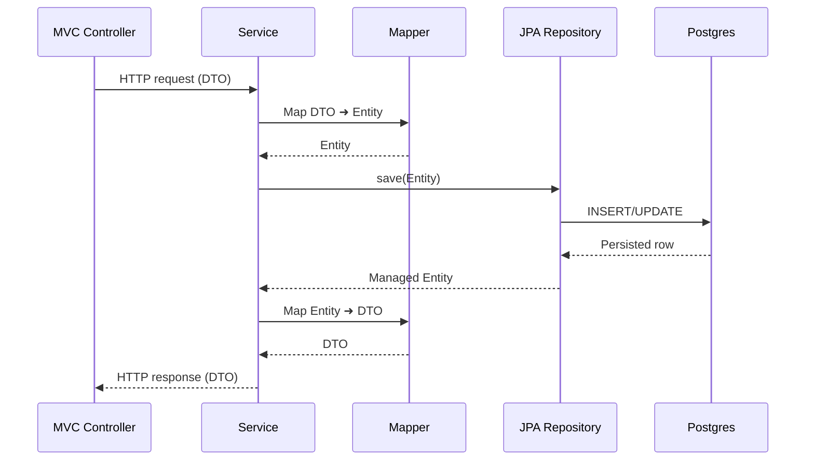

# Customer Insights Demo Workbench
This project is a demo Spring Boot / React application.

# Use Case
A SaaS company provides tools to help businesses manage customer interactions across email, chat, support tickets,
and feedback forms. They seek to develop an internal application that enables their Support, Product, and Customer
Success teams to better understand customer behavior.

# Project Description
The project uses Spring Boot 4 and Spring Framework 7 with the Maven build system.

## Project Design 
### Front End 
The front end is a React application that uses the Radix UI library for styling and components. This provides a 
modern consistent look and feel across the application, and will support a variety of screen sizes and devices.

RESTful APIs are used to communicate with the backend for query and persistence operations.

The vite build system is used to build, lint, test, and bundle the application.

### Front End Configuration
The front end configuration is stored in the `frontend/workbench/src/vite.config.ts` file. This file will be expanded upon in the future 
to support additional build configurations and deployment environments.

### Front End Build and Testing
The front end is built and tested using npm and vite.

To build the application, run the following command in the `frontend/workbench` directory:

```bash
npm run build
```

To run tests, use:
```bash
npm run test
```

### Back End 
The backend is a Spring Boot application that uses Spring Data JPA / Hibernate for persistence and Flyway for database 
migrations.

Spring Boot provides curated dependency versions for the Spring Framework, Spring Boot, and related libraries. Spring Boot
also provides opinionated defaults for application configuration and logging. Many of the configuration options can be 
overridden using environment variables for deployment flexibility.

Spring Boot is configured to use Flyway for database migrations from the `db/migration` directory.

Spring Data JPA is used to map between the domain objects and the database tables and 
for persistence operations. Bean validation is used to validate the domain objects and model POJOs.
OpenCSV is used to read and write CSV files. Jackson is used to serialize and deserialize JSON.

Mapstruct is used to map between domain objects and DTOs. This provides a simple and consistent method for converting 
between the two types of objects.

Builds and dependencies are managed using Maven.

### Back End Configuration
The backend configuration is stored in the `src/main/resources/application.properties` file. At this time deployment 
profiles are not required, but may be added in the future to support different deployment environments.

### Back End Build and Testing
The backend is built and tested using Maven.

### Testing Backend Application
To run the tests, verify Docker is installed and running locally.

From the root directory, run the following command to execute the tests:

```bash
./mvnw clean verify
```

### Packaging as jar

To build the final jar and optimize the demo application for production, run:

From posix operating systems:
```bash
./mvn clean verify
```

From Windows operating systems:
```bash
mvnw clean verify
```

### Local Development
To run the application locally, run the following commands.

To start the backend,

```bash
./mvnw spring-boot:run
```

To start the frontend from a separate terminal run,

```bash
cd frontend/workbench
npm run dev
```

The frontend application will automatically reload when changes are made to the source code.

Currently, the backend does not automatically reload when changes are made to the source code. But
Spring Development Tools may be added at a later time to support this.

## Bundling for Deployment
Spring Boot by default supports the serving of static resources from the classpath via the `resources/static` handler.

The React application is bundled into the `resources/static` directory during the Maven build. This will provide
a single executable JAR file that can easily be deployed to services such as AWS Elastic Beanstalk.

## Deployment
Refer to the [AWS Deployment document](AWS-Deployment.md) for details on deploying the application to AWS.

# Project Overview 
## Technologies
- Spring Boot 4 / Spring Framework 7
  - Spring Data JPA / Hibernate
  - Flyway
  - H2 (testing) / Postgres (production)
  - Java 25
  - Maven
  - Docker
- React Front End
  - Typescript
  - Tailwind CSS
  - Radix UI
  - Shadcn 
  - Axios
  - Vite
  - Jest

## Directory Structure
```
customer-workbench/
├── README.md
├── compose.yaml (Docker Compose for Local Development)
├── devprompts (Junie Prompt History)
├── mvnw (Maven Wrapper Posix)
├── mvnw.cmd (Maven Wrapper Windows)
├── pom.xml (Maven POM)
├── src/ (Source Code)
│   ├── main/ (Java Main Source)
│   │   │   ├── bootstrap/ (Bootstrap Code)
│   │   │   ├── controller/ (Spring MVC Controller)
│   │   │   ├── domain/ (JPA Domain Objects)
│   │   │   ├── mappers/ (MapStruct Object Mappers)
│   │   │   ├── model/ (Domain Objects)
│   │   │   ├── repositories/ (Spring Data Repositories)
│   │   │   └── services/ (Business Services)
│   │   ├── resources/
│   │   │   ├── application.properties (Application Properties)
│   │   │   ├── db/migration/ (Flyway Database Migrations)
│   │   │   ├── static/ (Web Resources
│   │   └── frontend/workbench/ (React Frontend)
│   └── test/ (Java Test Source)
└── target/  (Maven Build Output)
```

## ERD Diagram

## Backend Sequence Diagram
The diagram below shows the typical request lifecycle through the backend: an HTTP request hits the MVC controller, 
flows into the service layer, uses MapStruct to convert between DTOs and JPA entities, persists via a Spring Data JPA 
repository, and finally reads/writes to Postgres before the mapped response returns to the client.



# Agentic Development With JetBrains Juine
The project has largely been created using Agentic Development with JetBrains Juine.

A history of prompts is stored in the `devprompts/applied` directory. Markdown is used to provide AI a better context
of the commands.

Junie's behavior has been fine-tuned to provide consistency across the project. The guidelines provided to Junie are in 
the directory `.junie/guidelines.md`. This is a living document and will be updated as needed.

# Open Tasks and Further Improvements
1. Configure Maven FrontEnd Plugin to bundle React application.
2. Add React build, test, and packaging steps to the Maven build.
3. Review Bean validation use with OpenCSV for potential simplification.
4. Review Test Coverage for completeness and additional edge cases.
5. Review and improve logging and error handling.
6. Configure GitHub Actions for CI/CD.
7. Explore using GitHub Actions for automated deployment to AWS.
8. Add User Authentication and Authorization. Consider using Spring Security with OAuth 2.0 with JWT Tokens.
9. Determine the identity provider for authentication. Options to consider: AWS Cognito, Keycloak, Auth0, and Spring Authorization Server.
10. Add Spring Boot Development Tools for local development.
11. Consider enabling Native Image compilation for faster startup times.
12. Add API Documentation using OpenAPI and Redoc.

