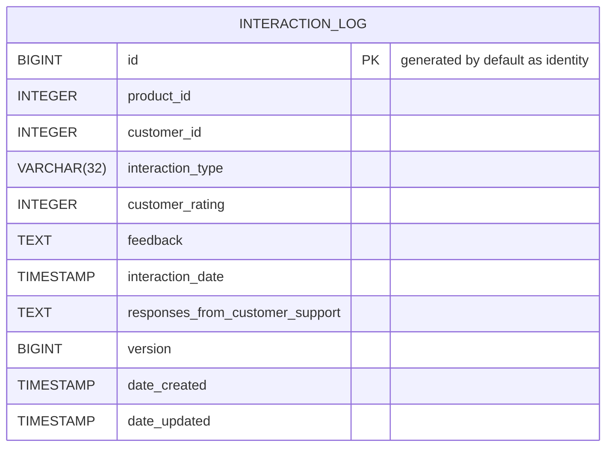
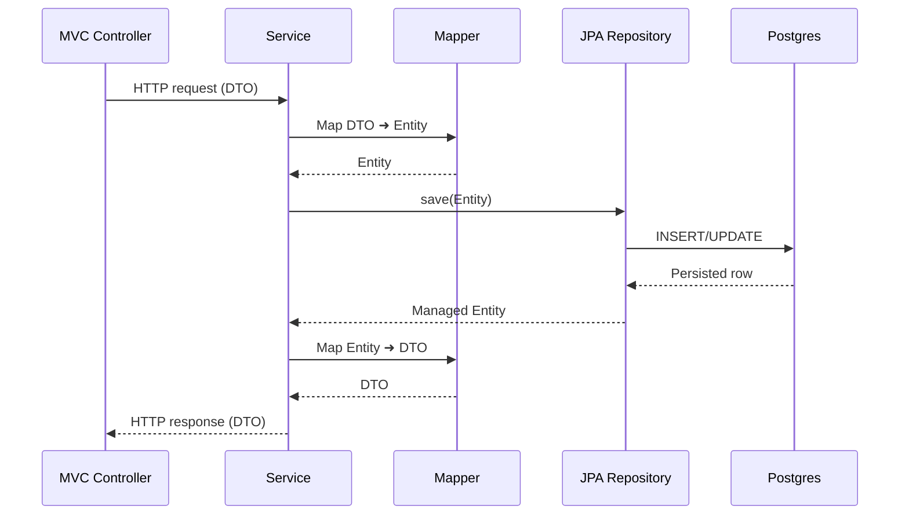

# Customer Insights Demo Workbench
This project is a demo Spring Boot / React application.

## Use Case
A SaaS company provides tools to help businesses manage customer interactions across email, chat, support tickets,
and feedback forms. They seek to develop an internal application that enables their Support, Product, and Customer
Success teams to better understand customer behavior.

# Technologies
- Spring Boot 4 / Spring Framework 7
  - Spring Data JPA / Hibernate
  - Flyway
  - H2 (testing) / Postgres (production)
  - Java 25
  - Maven
  - Docker
- React Front End
  - Typescript
  - Tailwind CSS
  - Radix UI
  - Shadcn 
  - Axios
  - Vite
  - Jest

# Project Description
The project uses Spring Boot 4 and Spring Framework 7 with the Maven build system.

## Directory Structure

```
customer-workbench/
├── README.md
├── compose.yaml (Docker Compose for Local Development)
├── devprompts (Junie Prompt History)
├── mvnw (Maven Wrapper Posix)
├── mvnw.cmd (Maven Wrapper Windows)
├── pom.xml (Maven POM)
├── src/ (Source Code)
│   ├── main/ (Java Main Source)
│   │   │   ├── bootstrap/ (Bootstrap Code)
│   │   │   ├── controller/ (Spring MVC Controller)
│   │   │   ├── domain/ (JPA Domain Objects)
│   │   │   ├── mappers/ (MapStruct Object Mappers)
│   │   │   ├── model/ (Domain Objects)
│   │   │   ├── repositories/ (Spring Data Repositories)
│   │   │   └── services/ (Business Services)
│   │   ├── resources/
│   │   │   ├── application.properties (Application Properties)
│   │   │   ├── db/migration/ (Flyway Database Migrations)
│   │   │   ├── static/ (Web Resources
│   │   └── frontend/workbench/ (React Frontend)
│   └── test/ (Java Test Source)
└── target/  (Maven Build Output)
```

# ERD Diagram

# Backend Sequence Diagram

The diagram below shows the typical request lifecycle through the backend: an HTTP request hits the MVC controller, 
flows into the service layer, uses MapStruct to convert between DTOs and JPA entities, persists via a Spring Data JPA 
repository, and finally reads/writes to Postgres before the mapped response returns to the client.



# Bundling for Deployment
Spring Boot by default supports the serving of static resources from the classpath via the `resources/static` handler.

The React application is bundled into the `resources/static` directory during the Maven build. This will provide
a single executable JAR file that can easily be deployed to services such as AWS Elastic Beanstalk.

# Deployment
Refer to the [AWS Deployment document](AWS-Deployment.md) for details on deploying the application to AWS.

# Open Tasks
1. Configure Maven FrontEnd Plugin to bundle React application.
2. Add React build and test steps to Maven build.
3. Review Bean validation use with OpenCSV for potentail simplification.
4. Review Test Coverage for completeness and additional edge cases.
5. Configure GitHub Actions for CI/CD.
6. Explore using GitHub Actions for automated deployment to AWS.
7. Add User Authentication and Authorization. Consider using Spring Security with OAuth 2.0 with JWT Tokens.
8. Determine identity provider for authentication. Options to consider: AWS Cognito, Keycloak, Auth0, and Spring Authorization Server.


